# ModelForge UML Diagrams (Mermaid Format)

This document contains all UML diagrams in Mermaid syntax for automatic rendering on GitHub, GitLab, and documentation platforms.

## Table of Contents
1. [Class Diagrams](#class-diagrams)
2. [Sequence Diagrams](#sequence-diagrams)
3. [State Diagrams](#state-diagrams)
4. [Component Diagrams](#component-diagrams)

---

## Class Diagrams

### 1. Core Engine Architecture

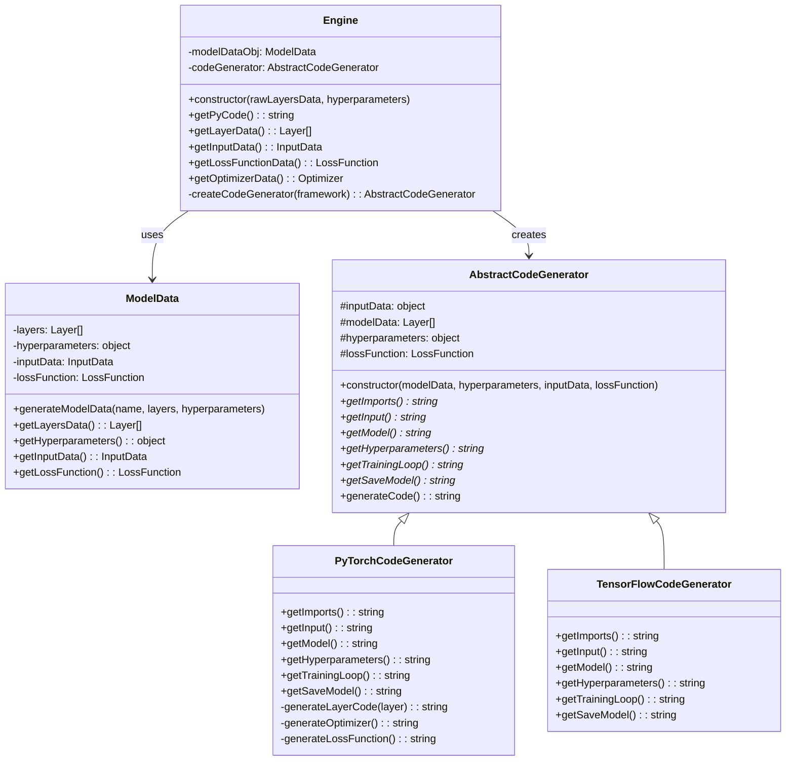

### 2. Model Node Management

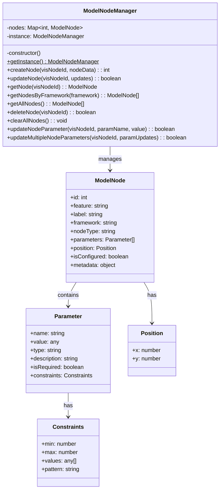

### 3. Graph Management

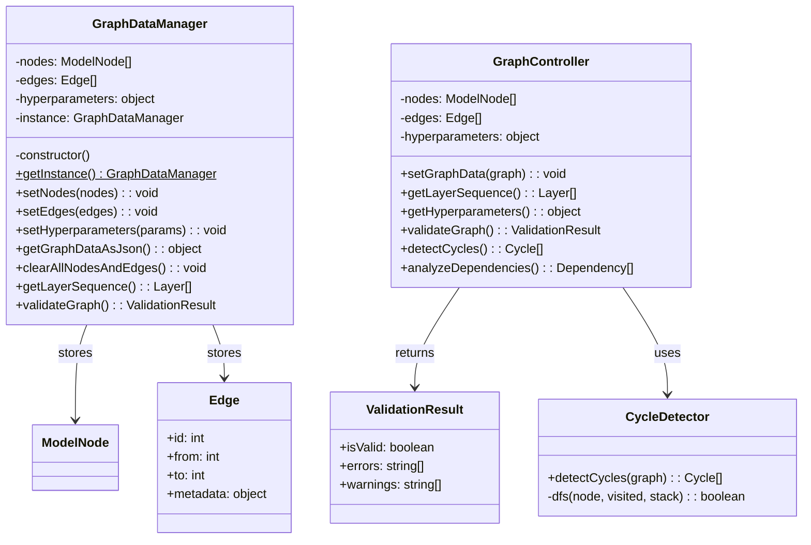

### 4. File Management

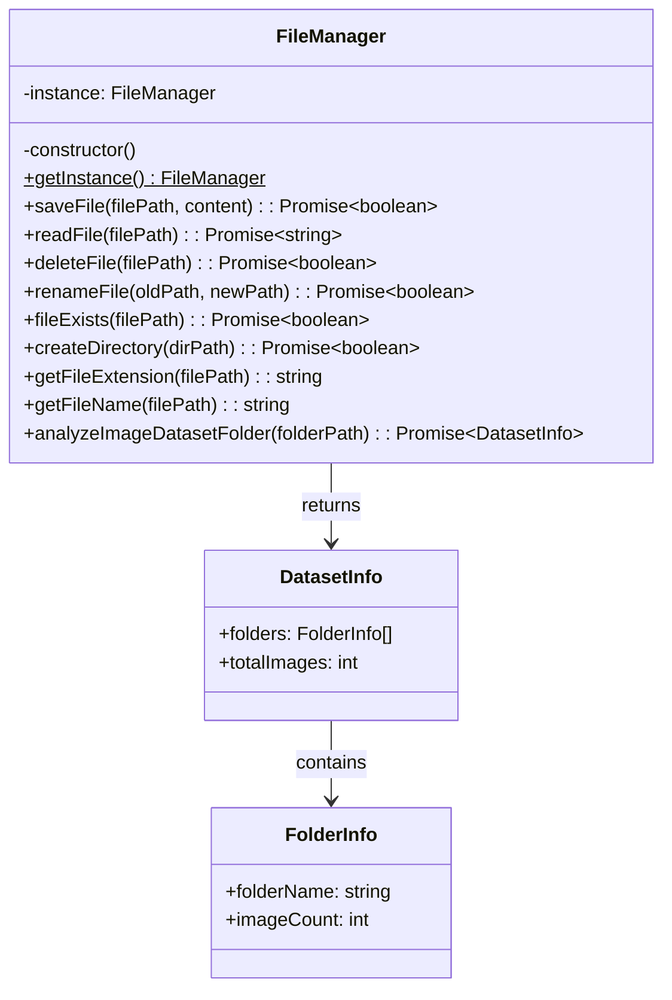

### 5. Input Data Processing

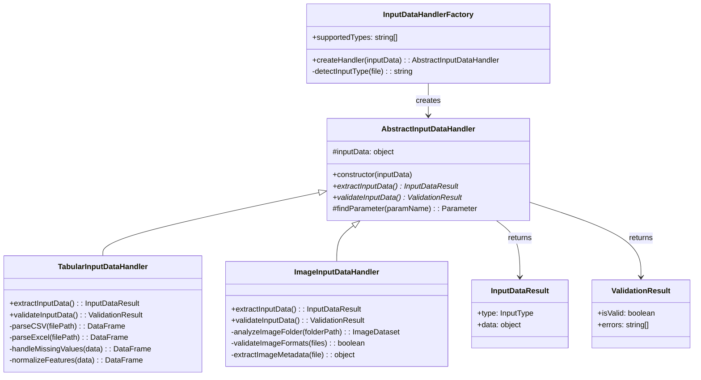

### 6. Model Controllers

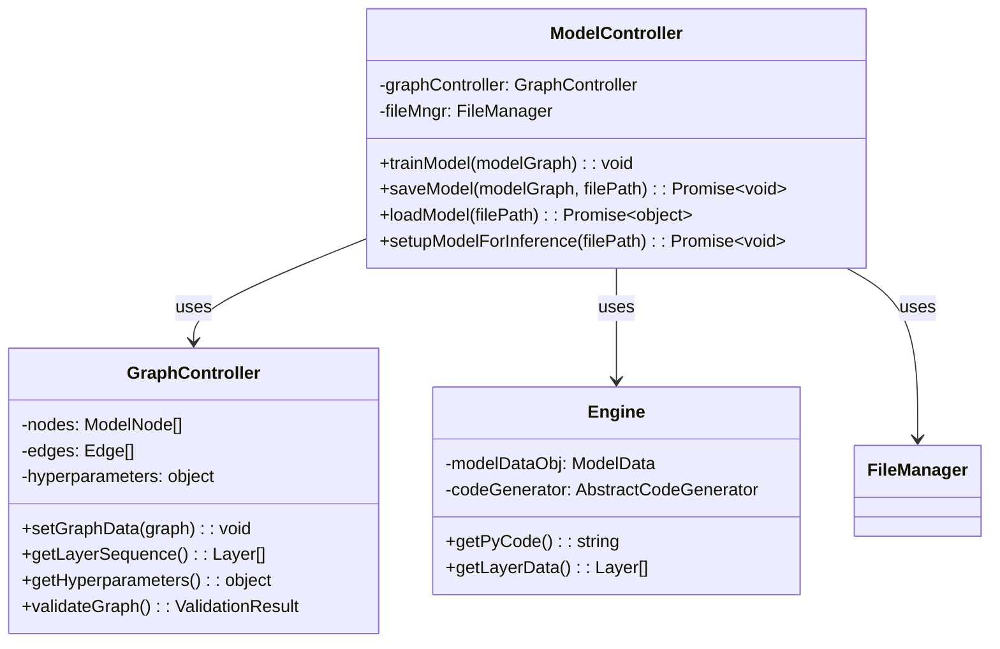

---

## Sequence Diagrams

### 1. Model Training Workflow

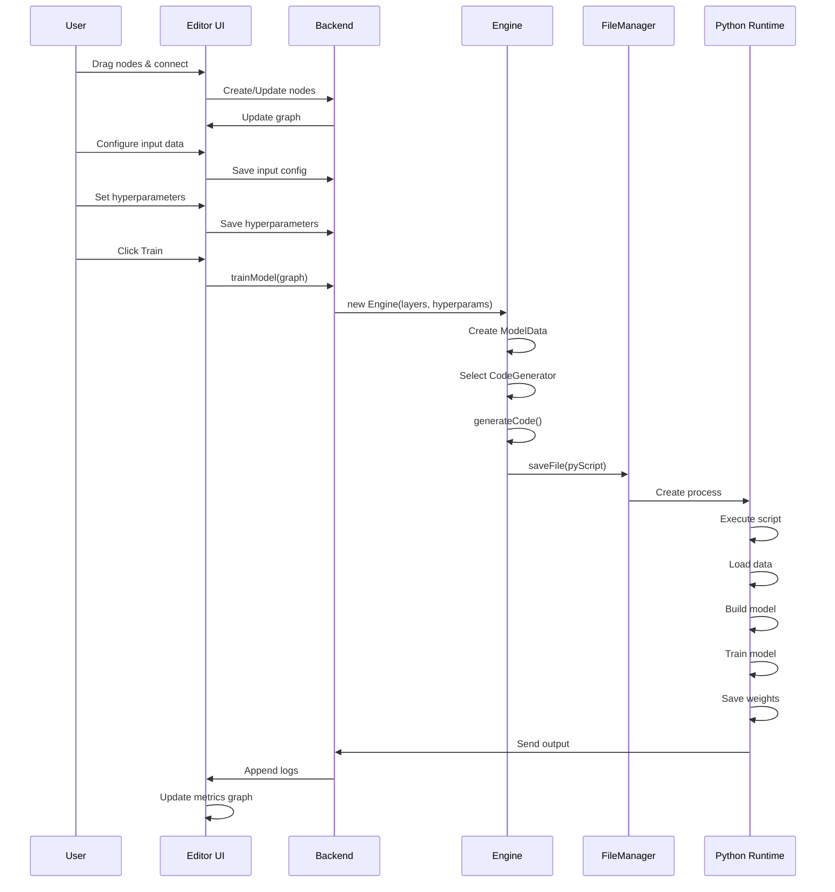

### 2. Model Save & Load Workflow

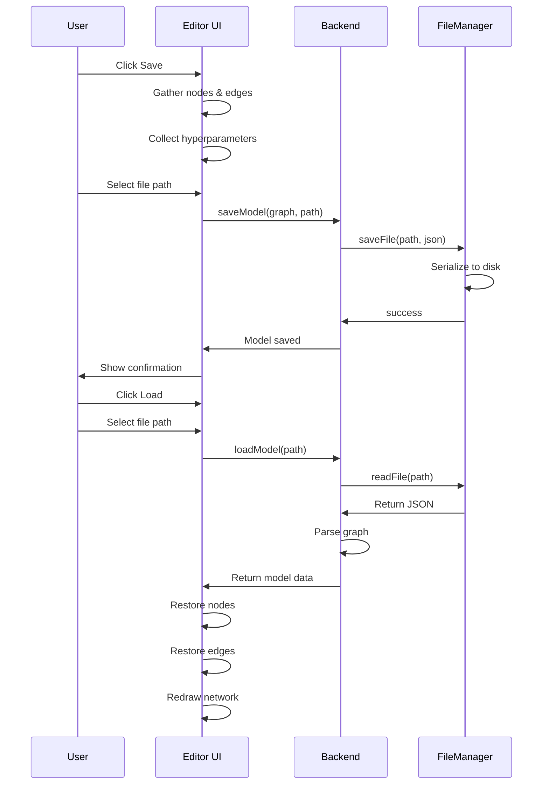

### 3. Input Data Configuration

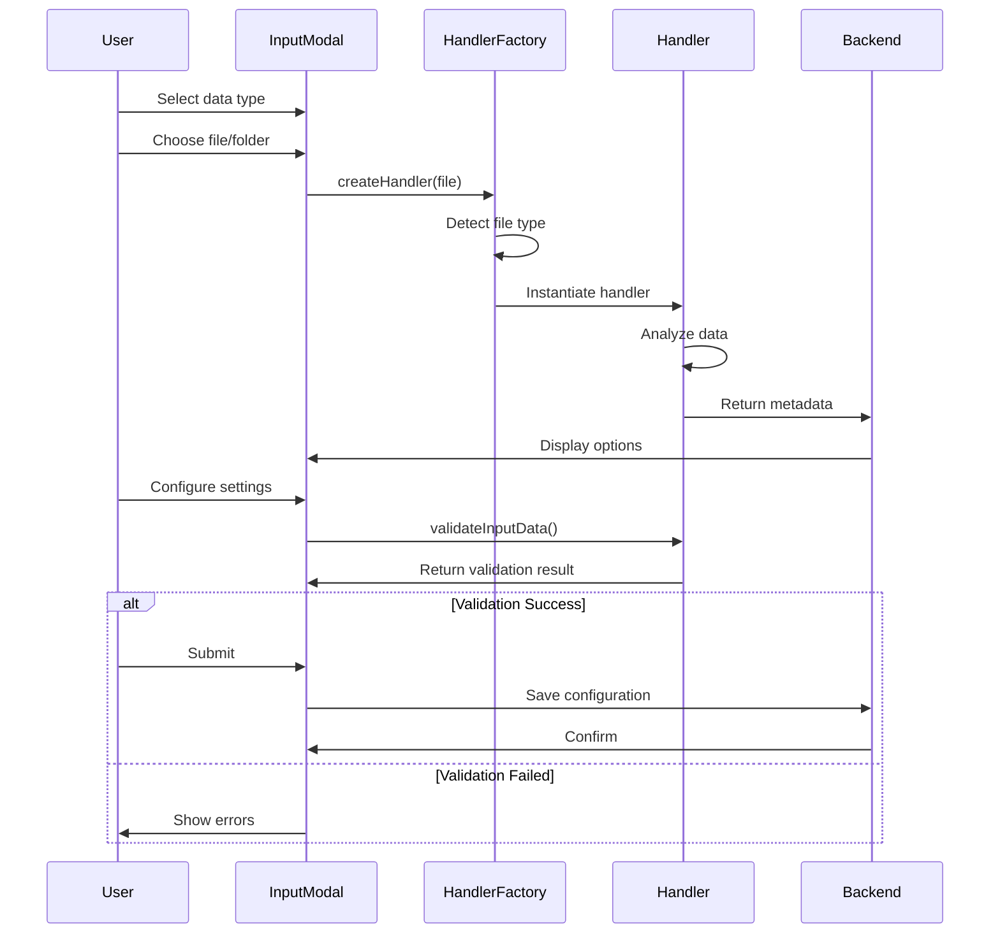

### 4. Code Generation Workflow

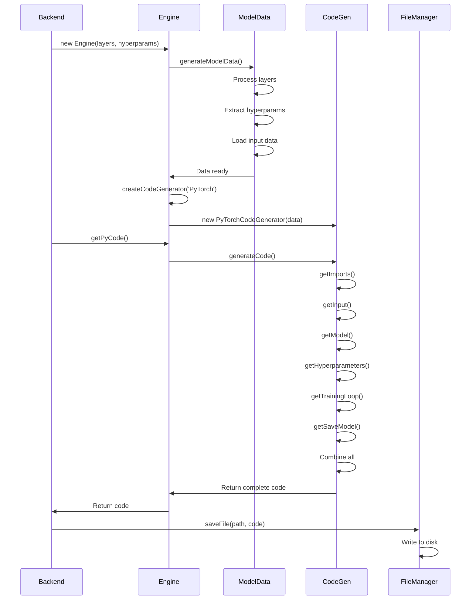

---

## State Diagrams

### 1. Model Training States

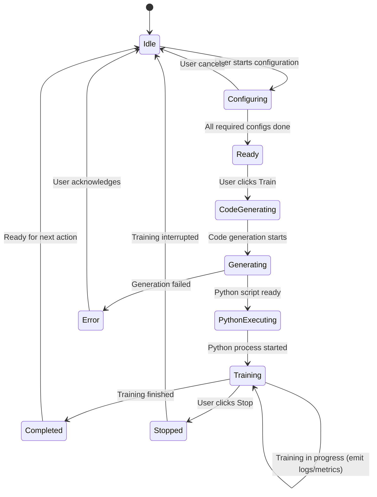

### 2. Graph Editor States

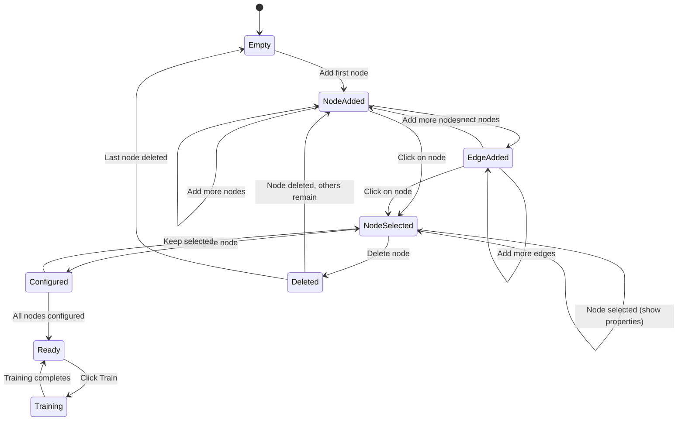

### 3. Application Lifecycle

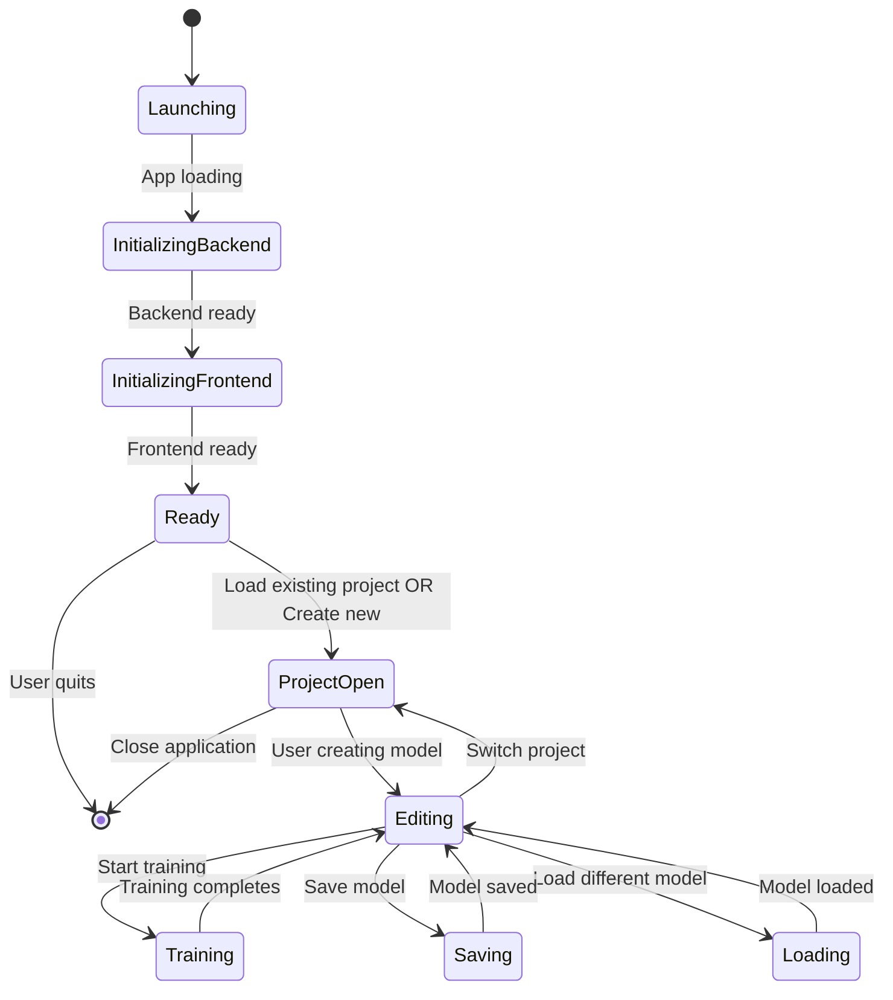

---

## Component Diagrams

### 1. Frontend Component Architecture

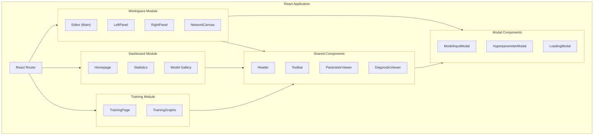

### 2. Backend Component Architecture

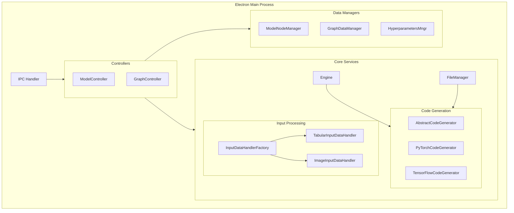

---

## Use Case Diagram

```mermaid
usecase diagram
    User as U
    Admin as A
    
    usecase "Create Model" as CreateModel
    usecase "Configure Nodes" as ConfigNodes
    usecase "Connect Layers" as Connect
    usecase "Load Dataset" as LoadData
    usecase "Set Hyperparameters" as SetHyper
    usecase "Train Model" as Train
    usecase "View Metrics" as ViewMetrics
    usecase "Save Model" as Save
    usecase "Load Model" as Load
    usecase "Export Code" as Export
    usecase "Inference" as Inference
    usecase "Manage Templates" as Templates
    
    U --> CreateModel
    U --> ConfigNodes
    U --> Connect
    U --> LoadData
    U --> SetHyper
    U --> Train
    U --> ViewMetrics
    U --> Save
    U --> Load
    U --> Export
    U --> Inference
    
    A --> Templates
    A --> CreateModel
    
    CreateModel .> ConfigNodes : includes
    CreateModel .> Connect : includes
    Train .> LoadData : requires
    Train .> SetHyper : requires
    Train .> ViewMetrics : includes
```

---

## Entity Relationship Diagram

```mermaid
erDiagram
    MODEL ||--o{ NODE : contains
    MODEL ||--o{ EDGE : contains
    MODEL ||--|| HYPERPARAMETER : has
    
    NODE ||--o{ PARAMETER : has
    NODE ||--|| INPUTDATA : requires
    
    INPUTDATA ||--|| DATASET : references
    DATASET ||--o{ DATAFILE : contains
    
    TRAINING ||--|| MODEL : trains
    TRAINING ||--o{ METRIC : generates
    TRAINING ||--o{ LOG : produces
    
    WEIGHT ||--|| TRAINING : resultOf
    WEIGHT ||--|| MODEL : savedIn
    
    MODEL-NAME : string
    MODEL-FRAMEWORK : string
    MODEL-CREATED-AT : datetime
    
    NODE-ID : int
    NODE-FEATURE : string
    NODE-LABEL : string
    NODE-POSITION : point
    
    PARAMETER-NAME : string
    PARAMETER-VALUE : any
    PARAMETER-TYPE : string
    
    TRAINING-ID : int
    TRAINING-START-TIME : datetime
    TRAINING-END-TIME : datetime
    TRAINING-EPOCHS : int
```

---

## Information Architecture

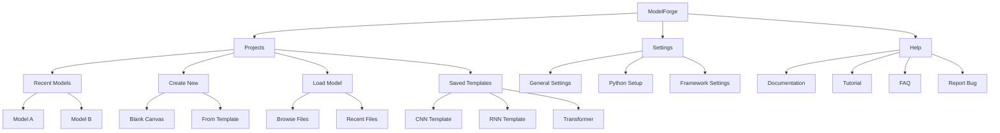

---

## Summary

This document contains comprehensive UML diagrams in Mermaid syntax covering:

1. **Class Diagrams**: 
   - Core Engine Architecture
   - Model Node Management
   - Graph Management
   - File Management
   - Input Data Processing
   - Model Controllers

2. **Sequence Diagrams**:
   - Model Training Workflow
   - Model Save & Load Workflow
   - Input Data Configuration
   - Code Generation Workflow

3. **State Diagrams**:
   - Model Training States
   - Graph Editor States
   - Application Lifecycle

4. **Component Diagrams**:
   - Frontend Component Architecture
   - Backend Component Architecture
   - Use Case Diagram
   - Entity Relationship Diagram
   - Information Architecture

These diagrams can be rendered directly in:
- GitHub markdown files
- GitLab markdown files
- Notion pages
- Documentation wikis
- Any platform supporting Mermaid syntax
